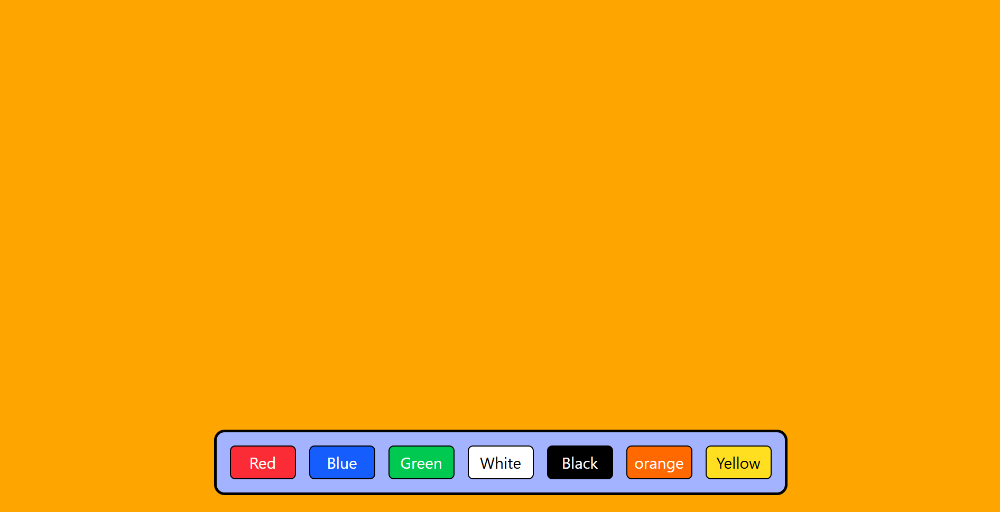

# 🎨 Background Changer - React Project  

## 🌟 Overview  
The **Background Changer** is a simple yet interactive React application that allows users to change the background color dynamically using "onClick()" event by when user clicks one color. Choosing from a preset palette users can personalize their experience with just a click.

## 🚀 Features  
- 🎨 Change background colors with ease  
- 💡 Lightweight and fast  
- ⚡ Built with React  

## 🛠️ Tech Stack  
- React.js  
- HTML
- CSS
- JavaScript

## 📦 Installation & Setup  

1. Clone the repository:  
   ```sh
   git clone <your-repo-link>
   cd color-changer
2. Install the dependencies
   ```
   npm install
3. Run the project
   ```
   npm run dev
## 📷 Preview  
  

🤝 Contributing

Feel free to fork this project and contribute to its improvement!


Let me know if you need any modifications! 🚀
